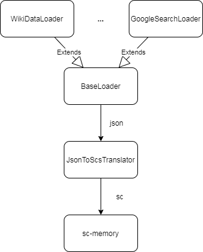
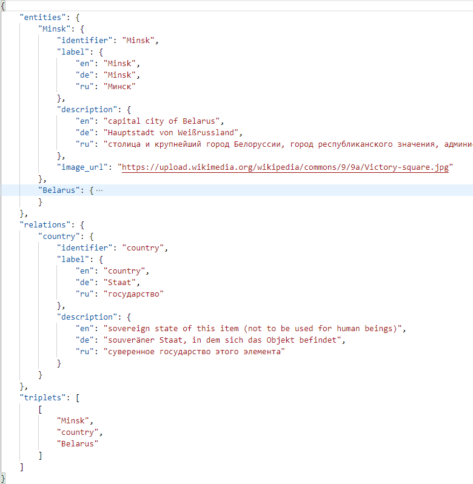
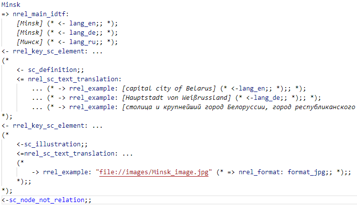

Data2sc-parser
============

About
------------

This is a set of loaders and translators for extracting knowledge from external sources.

### Supported external sources

* WikiData
* Google Search

How it works
------------

You input entities to get from external source. Loader make requests to source and gives all info in JSON format. After that info in JSON translates to SCS and saves to directory you choose.

Requirements
------------

For requirements installation use

    pip install -r requirements.txt

Usage
------------

Example

    python3 parse.py Minsk Belarus "Belarusian State University of Informatics and Radioelectronics"

* Input all entities titles with a space
* Then type language of title with `--lang` attribute (by default its 'en')
* Don't forget to choose directory for saving scs files and images. Make it with `--dir` attribute (by default its 'sc_out')
* Select external source with attribute `--source` from 'wiki' and 'google' (by default its 'wiki')
* If you want to get information about entity with context (relations with other entities and etc.) use `--context=yes` (by default its 'no')
* To get an intermediate JSON file use `--debug=yes` (by default its 'no')

Example with attributes

    python3 parse.py Минск --lang=ru --dir=output_dir --debug=yes

For help enter

    python3 parse.py --help

Architecture
------------

Architecture of the parser looks like this:

There is a base abstract class from which other translators are inherited. They implement the `getEntity()` method, adhering to a specific structure of a JSON file.

Structure of JSON file is displayed below:

You can see 3 sections:

* `entities`
* `relations`
* `triplets`

In `entities` section stores info about all entities which was loaded from external sources. Each entity include `identifier`, `label` and `description`. `label` and `description` include information in different languages. If loaded entity has image in `image_url` stores URL for loading this image.

For `relations` section stores info about relations. All the same as in `entities` section but relations usually don't have images.

In `triplets` section stores relations between entities. It is represented in form of triplets, where the first element is the entity from which a relation goes to the second entity. Second element is the relation that two entities. Third element is second entity.

After loading data JSON file translating by JsonToScsTranslator and all info saves to SCs files.

Example of SCs file you can see below:

Contribute
------------

Pull requests are very welcome!

It would be great to hear your feedback and suggestions in the [issue tracker](https://github.com/ostis-apps/data2sc-parser/issues)!
